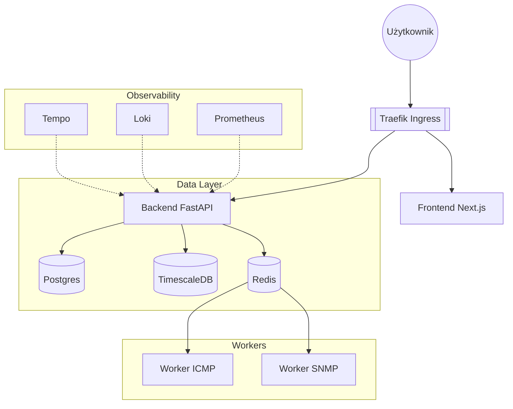

# Architektura Systemu SOTP

System oparty jest na architekturze [[Mikroserwisy|mikroserwisowej]] (lub modularnego monolitu) wdrażanej na platformie [[Kubernetes]].

## Warstwy Logiczne

### 1. Warstwa Interfejsu
- **Tech:** [[Next.js]] 14, [[React]], [[Tailwind CSS]], komponenty `shadcn/ui`.
- **Rola:** Wizualizacja danych, dashboardy operatorskie.

### 2. Brama API (API Gateway)
- **Tech:** [[Traefik]] (Ingress Controller).
- **Funkcje:** Rate limiting, terminacja [[SSL/TLS]], routing.

### 3. Warstwa Aplikacji (Backend)
- **Tech:** [[FastAPI]] (Python).
- **Serwisy:**
    - `Device Service` - inwentaryzacja.
    - `Auth Service` - bezpieczeństwo ([[Oauth2]]/[[JWT]]).
    - `Alerting Service`.

### 4. Warstwa Workerów (Kolektory)
- **Tech:** [[Celery]] + [[Redis]] (Broker).
- **Zadania:** Asynchroniczne zbieranie danych przez [[SNMP]], [[ICMP]], [[SSH]].

### 5. Warstwa Danych
- **[[PostgreSQL]]** - dane relacyjne (użytkownicy, inwentarz).
- **[[TimescaleDB]]** - szeregi czasowe (metryki, historia).
- **[[HashiCorp Vault]]** - bezpieczny magazyn sekretów.

## Diagram Wdrożenia (Kubernetes)

