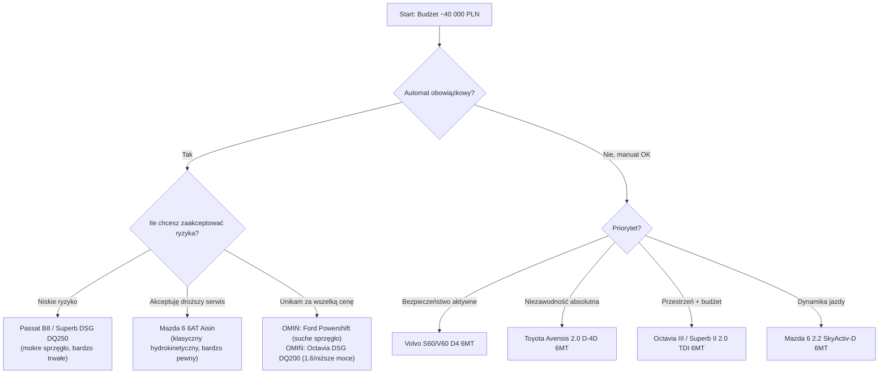

# 🚗 Baza Wiedzy: Zakup Używanego Diesla Klasy D/C (~40 000 PLN)

> [!info] Profil zakupowy
> - **Budżet:** ~40 000 PLN, z tolerancją na dopłatę, jeśli unika to kosztownych napraw. Pakiet startowy (płyny, ogumienie, drobne naprawy) to **osobny fundusz**.
> - **Nadwozie:** 1. Liftback → 2. Kombi → 3. Sedan (hatchback tylko w ostateczności)
> - **Segment:** D (klasa średnia) lub wyrośnięty C (np. Octavia)
> - **Silnik:** Diesel, docelowo 2.0, duży moment obrotowy (bezpieczne, dynamiczne wyprzedzanie)
> - **Skrzynia:** Automat preferowany, ale solidny manual w pełni akceptowalny
> - **Priorytety:** 1) Bezpieczeństwo → 2) Jakość wykonania → 3) Niezawodność

To jest **notatka-hub**. Każdy model ma swoją atomową notatkę w folderze `Modele/` — korzystaj z linków, żeby poruszać się między porównaniami.

---

## 1. Przegląd Rynku — Ranking 10 Modeli

| # | Model | Silnik / Moc | Skrzynia | Nadwozia | Orientacyjny "sweet spot" cenowy w 40k | Ocena ogólna |
|---|-------|-------------|----------|----------|------------------------------------------|---------------|
| 1 | [[02 Obszary/Modele/Skoda_Octavia_III_2.0TDI\|Škoda Octavia III 2.0 TDI]] | 150 KM / 320 Nm (EA288) | manual 6MT / DSG DQ200/DQ250 | Liftback, Kombi | 2015–2017, 150–220 tys. km | ⭐⭐⭐⭐⭐ Najlepszy kompromis |
| 2 | [[02 Obszary/Modele/Skoda_Superb_II_III_2.0TDI\|Škoda Superb II/III 2.0 TDI]] | 140–190 KM / 320–400 Nm | manual / DSG DQ250/DQ381 | Liftback, Kombi | Superb II 2013–2015, wyższy przebieg | ⭐⭐⭐⭐⭐ Najwięcej miejsca |
| 3 | [[02 Obszary/Modele/VW_Passat_B8_2.0TDI\|VW Passat B8 2.0 TDI]] | 150–190 KM / 340–400 Nm | manual / DSG DQ250 | Sedan, Kombi | 2015–2017, 180–220 tys. km | ⭐⭐⭐⭐⭐ Najlepsza jakość wnętrza |
| 4 | [[02 Obszary/Modele/Ford_Mondeo_MK5_2.0TDCi\|Ford Mondeo Mk5 2.0 TDCi]] | 150–180 KM / 370–400 Nm | manual 6MT / Powershift 6AT | Liftback, Kombi | 2015–2017, tańszy niż konkurencja | ⭐⭐⭐⭐ Tylko z manualem |
| 5 | [[02 Obszary/Modele/Peugeot_508_I_2.0HDi_BlueHDi\|Peugeot 508 I 2.0 HDi/BlueHDi]] | 140–180 KM / 320–400 Nm | manual / automat 6AT | Sedan, Kombi (SW) | 2012–2015, bardzo tanio | ⭐⭐⭐⭐ Niedoceniony, świetny komfort |
| 6 | [[02 Obszary/Modele/Mazda_6_III_2.2SkyActivD\|Mazda 6 III (GJ) 2.2 SkyActiv-D]] | 150–175 KM / 380–420 Nm | manual / 6AT (Aisin) | Sedan, Kombi | 2015–2017 | ⭐⭐⭐⭐⭐ Najlepsza dynamika i prowadzenie |
| 7 | [[02 Obszary/Modele/Opel_Insignia_A_2.0CDTI\|Opel Insignia A 2.0 CDTI]] | 130–195 KM / 300–400 Nm | manual / 6AT | Sedan, Kombi (Sports Tourer) | 2013–2015, bardzo szeroki wybór | ⭐⭐⭐ Świetne LED, słabsza marka |
| 8 | [[02 Obszary/Modele/Toyota_Avensis_T27_2.0D4D\|Toyota Avensis T27 2.0 D-4D]] | 143 KM / 320 Nm | manual / automat (rzadki) | Sedan, Kombi | 2012–2015 | ⭐⭐⭐⭐ Żelazna niezawodność, słabsza dynamika |
| 9 | [[02 Obszary/Modele/Volvo_S60_V60_D3_D4\|Volvo S60/V60 D3/D4 Drive-E]] | 150–190 KM / 320–400 Nm | manual / Geartronic 6AT/8AT | Sedan, Kombi | 2014–2016, wyższy przebieg za 40k | ⭐⭐⭐⭐⭐ Lider bezpieczeństwa |
| 10 | [[02 Obszary/Modele/Kia_Optima_Hyundai_i40_CRDi\|Kia Optima / Hyundai i40 1.7 CRDi]] | 136–141 KM / 320–340 Nm | manual / DCT 7-biegowy | Sedan, Kombi (i40) | 2014–2016 | ⭐⭐⭐ Budżetowy plan B |

---

## 2. Drzewo Decyzyjne (Kompromisy)

### 2.1 Pierwsze rozwidlenie: Automat czy manual?

### 2.2 Kompromisy Model A vs Model B

**Škoda Octavia III vs Škoda Superb II/III**
- **Zyskujesz** (Octavia): niższa cena zakupu za ten sam rocznik, mniejsza masa → mniejsze zużycie sprzęgła/dwumasy, łatwiejszy parking.
- **Tracisz**: przestrzeń na nogi z tyłu, mniejszy bagażnik, nieco tańszy odczuwalnie plastik w wersjach podstawowych.

**Škoda Octavia III vs VW Passat B8**
- **Zyskujesz** (Octavia): ten sam silnik EA288 za mniejsze pieniądze, więcej egzemplarzy w budżecie z niższym przebiegiem.
- **Tracisz**: jakość tłumienia hałasu, sztywność nadwozia, wyższą wartość rezydualną Passata (czyli przy dalszej sprzedaży stracisz relatywnie więcej na Octavii % biorąc pod uwagę cenę zakupu — w praktyce podobnie).

**VW Passat B8 vs Ford Mondeo Mk5** *(zbliżone segmenty i silniki DW10/EA288)*
- **Zyskujesz** (Passat): lepiej oceniana jakość wnętrza, silniejsza pozycja rynkowa (łatwiejszy resell), pasek rozrządu w kąpieli olejowej (żywotność do ~200 tys. km).
- **Tracisz**: cenę — Mondeo za te same pieniądze da Ci wyższą wersję wyposażenia i/lub niższy przebieg, bo jest mniej pożądany na rynku. Ryzyko: jeśli trafisz na automat, Mondeo z Powershift jest zauważalnie bardziej awaryjne niż Passat z DSG DQ250.

**Ford Mondeo Mk5 vs Peugeot 508 I** *(oba korzystają z podobnej rodziny diesli PSA/Ford DW10)*
- **Zyskujesz** (Mondeo): nieco lepsze prowadzenie, dostępność AWD, silniejsze wersje (180/209 KM).
- **Tracisz**: cenę zakupu — 508 jest zwykle tańszy w zakupie, ma bardzo wygodne fotele i komfortowe zawieszenie, ale rynek wtórny traktuje go surowiej (mniejsze zaufanie do marki = niższa cena, ale też trudniej sprzedać).

**Mazda 6 vs Škoda Octavia/Superb (diesel)**
- **Zyskujesz** (Mazda): brak paska rozrządu (łańcuch — mniej rutynowych kosztów), lepiej prowadzi się na drodze (właściwości jezdne bliżej premium), bardzo solidny blok silnika.
- **Tracisz**: gorszą dostępność części w małych warsztatach niż VAG, mniejszą przestrzeń w kabinie niż Superb, ryzyko rozcieńczenia oleju paliwem przy głównie miejskiej eksploatacji (wymaga pilnowania poziomu oleju).

**Toyota Avensis vs cała reszta**
- **Zyskujesz**: najniższe ryzyko poważnej, kosztownej awarii silnika — to najbardziej "bezobsługowy" wybór na liście.
- **Tracisz**: dynamikę (słabszy moment obrotowy niż w 2.0 TDI/TDCi/HDi), nowocześniejsze systemy bezpieczeństwa (Toyota Safety Sense dopiero od faceliftu ~2015), świeższość konstrukcji (model wycofany z produkcji w 2018 r., więc egzemplarze są już starsze na starcie).

**Volvo S60/V60 vs Passat B8 / Superb**
- **Zyskujesz** (Volvo): zdecydowanie najlepsze bezpieczeństwo aktywne i pasywne w tej grupie (City Safety z automatycznym hamowaniem był **standardem** dużo wcześniej niż u konkurencji), bardzo dobre fotele.
- **Tracisz**: przy budżecie 40k dostajesz egzemplarz z wyższym przebiegiem lub słabszą wersją silnika niż w Passacie/Superbie za te same pieniądze, koszty serwisu bliższe segmentowi premium (dealerskie części), mniejszy bagażnik w S60 (sedan) niż w kombi konkurencji.

**Opel Insignia vs reszta**
- **Zyskujesz**: najniższa cena zakupu w segmencie, dostęp do matrycowych reflektorów LED (IntelliLux) nawet w niższym budżecie, duża przestrzeń.
- **Tracisz**: wartość rezydualną (Insignia najszybciej traci na wartości), postrzeganą jakość materiałów wnętrza, pewność co do przyszłej sprzedaży (mniejszy popyt = dłuższe wystawienie na sprzedaż).

**Kia Optima / Hyundai i40 vs reszta**
- **Zyskujesz**: pierwotnie bardzo długą gwarancję fabryczną (co często oznacza lepiej dopilnowaną historię serwisową), niską cenę, prosty i solidny łańcuch rozrządu.
- **Tracisz**: moment obrotowy (1.7 CRDi ma zauważalnie mniej "zapasu mocy" do bezpiecznego wyprzedzania niż 2.0 TDI/TDCi/HDi) — **to jest kompromis, który koliduje z Twoim priorytetem dynamiki**, dlatego ten model traktuj jako plan B, nie pierwszy wybór.

---

## 3. Analiza Kosztów (TCO) — Tabela Zbiorcza

> [!warning] Jak czytać tę tabelę
> Podane kwoty to typowe, rynkowe ceny części + robocizna w niezależnym serwisie (nie ASO), przy przebiegu 150–250 tys. km. To są koszty **prewencyjne/naprawcze do zabudżetowania**, nie gwarantowane wydatki — dobrze utrzymany egzemplarz może ich nie wymagać wcale.

| Model | Najsłabszy punkt (silnik) | Koszt | Najsłabszy punkt (skrzynia/sprzęgło) | Koszt |
|---|---|---|---|---|
| Octavia III 2.0 TDI | EGR, DPF, wtryskiwacze | EGR ~1000–2000 zł / DPF czyszczenie ~900 zł, regen. filtra 2000+ zł / wtrysk komplet ~4x400–800 zł | Dwumasa+sprzęgło (manual) ~2000–3000 zł / DSG mechatronika 3000–8000+ zł | — |
| Superb II/III 2.0 TDI | Pasek rozrządu (krytyczny — zerwanie = zawory!), EGR, DPF | Rozrząd+pompa wody 1800–3000 zł | Dwumasa ze sprzęgłem 2500–4500 zł / Haldex (4×4) — olej co 60 tys. | — |
| Passat B8 2.0 TDI | AdBlue (zamarzanie zimą), pasek w kąpieli olejowej | AdBlue serwis kilkaset zł | Mechatronika DSG — najdroższy element skrzyni | kilka tys. zł |
| Mondeo Mk5 2.0 TDCi | Pasek rozrządu, wtryskiwacze, DPF/EGR | Pasek ~1300–1400 zł, wtryski kilka tys. | **Powershift** — sprzęgła i mechatronika | suma serwisowa na 200 tys. km bywała rzędu 20 000+ zł na cały samochód |
| Peugeot 508 I HDi/BlueHDi | EGR (zwłaszcza BlueHDi), DPF | EGR ~2700 zł (oryginał) | Dwumasa+sprzęgło | ~2000–3000 zł |
| Mazda 6 2.2 SkyActiv-D | DPF (przy miejskiej eksploatacji), rozcieńczenie oleju paliwem | DPF czyszczenie/regeneracja, kontrola oleju | Sprzęgło+dwumasa (manual) | ~3000+ zł |
| Insignia A 2.0 CDTI | Sprzęgło (wysoki moment = szybsze zużycie), DPF | Sprzęgło 100–200 tys. km cyklicznie | Standardowy automat 6-biegowy — mniej ryzykowny niż DSG/Powershift | — |
| Toyota Avensis 2.0 D-4D | Pasek rozrządu (rutynowo, niska awaryjność poza tym) | Rutynowa wymiana wg harmonogramu | Sprzęgło — rzadko problematyczne | — |
| Volvo S60/V60 D3/D4 | Wczesne silniki Drive-E: wtryskiwacze, turbo (pierwsze roczniki) | Koszty na poziomie zbliżonym do premium | Geartronic — generalnie solidny | — |
| Kia/Hyundai 1.7 CRDi | Łańcuch rozrządu (rzadko problem), DPF | Niskie koszty eksploatacyjne | DCT (dwusprzęgłowa) — czułe na styl jazdy w mieście | — |

### Uniwersalne zasady, niezależnie od modelu
- **Historia serwisowa > przebieg.** Auto z 230 tys. km i fakturami za rozrząd/DPF/EGR jest bezpieczniejszym zakupem niż auto z 140 tys. km bez żadnych dowodów serwisu.
- **Diesel + krótkie trasy miejskie = wróg.** DPF i EGR degradują się najszybciej przy jeździe głównie po mieście — Twój profil (długie trasy) jest tu **dużą zaletą** i naturalnie zmniejszy ryzyko tych usterek.
- **Rozrząd na pasku = pytanie #1 przy każdym oglądaniu auta.** Brak faktury = zakładaj wydatek "startowy" z osobnego funduszu na pakiet startowy.

---

## 4. Wersje Wyposażenia i Pakiety Bezpieczeństwa — Na Co Polować

| Model | Wersja/pakiet do szukania | Kluczowe systemy bezpieczeństwa |
|---|---|---|
| Octavia III | Style / L&K, pakiet "Asystentów kierowcy" | Front Assist (AEB), ACC, Lane Assist, Full LED (od faceliftu 2017) |
| Superb II/III | Elegance / L&K, pakiet Driver Assistance | Front Assist, ACC, Lane Assist, Traffic Jam Assist, Matrix LED (L&K) |
| Passat B8 | Highline / Business, pakiet "Asystentów" | Front Assist, ACC, Side Assist (BSM), Emergency Assist, IQ.Light Full LED (po liftingu 2019) |
| Mondeo Mk5 | Titanium / Vignale | Adaptive LED, ACC z Forward Alert, BLIS (blind spot), Pre-Collision Assist |
| Peugeot 508 | Allure / GT Line (po liftingu 2015) | Full LED (od faceliftu), Distance Alert, Blind Spot Monitoring |
| Mazda 6 | i-Activsense (pakiet, od faceliftu 2015) | MRCC (radarowy ACC), Smart Brake Support (AEB), Lane Departure Warning, Adaptive LED |
| Insignia A | Cosmo / Elite, pakiet FlexRide + światła | **IntelliLux LED Matrix** (unikat w tym budżecie!), Forward Collision Alert, Lane Departure Warning |
| Avensis T27 | Executive (po liftingu 2015 z Toyota Safety Sense) | Toyota Safety Sense: AEB, Lane Departure Alert, Automatic High Beam |
| Volvo S60/V60 | Momentum / Summum | **City Safety (AEB) — standard od bardzo dawna**, BLIS, Pilot Assist (ACC), Cross Traffic Alert |
| Kia Optima / i40 | Platinum / Premium (po faceliftach) | Advanced Smart Cruise Control, Forward Collision Warning, Lane Departure Warning |

> [!tip] Priorytet zakupowy pod kątem bezpieczeństwa
> Jeśli **bezpieczeństwo jest priorytetem #1**, egzemplarz z pakietem asystentów w słabszym wyposażeniu ogólnym > bogato wyposażony egzemplarz bez ADAS. Full LED + AEB + ACC realnie zmniejszają ryzyko kolizji przy długich trasach nocnych i w trudnych warunkach — a to jest Twój główny scenariusz użytkowania.

---

## 5. Finalna Strategia Zakupu (Checklist)

1. **Zdefiniuj priorytet w obrębie priorytetów.** Jeśli bezpieczeństwo > wszystko: [[02 Obszary/Modele/Volvo_S60_V60_D3_D4|Volvo]] lub Octavia/Superb/Passat z pakietem asystentów. Jeśli niezawodność > wszystko: [[02 Obszary/Modele/Toyota_Avensis_T27_2.0D4D|Avensis]] lub [[02 Obszary/Modele/Mazda_6_III_2.2SkyActivD|Mazda 6]].
2. **Zawsze żądaj historii serwisowej** — potwierdzenie wymiany rozrządu/paska, oleju w DSG/automacie, stanu DPF.
3. **Test jazdy min. 20–30 minut**, w tym odcinek autostrady/drogi szybkiego ruchu — sprawdź pracę automatu na zimnym i rozgrzanym silniku, brak szarpania.
4. **Diagnostyka komputerowa (VCDS/OBD) przed zakupem** — obowiązkowa, koszt 100–200 zł, może uratować Cię przed wydatkiem rzędu kilku tysięcy.
5. **Zarezerwuj pakiet startowy** (niezależny od budżetu 40k) na: rozrząd (jeśli brak faktury), płyny eksploatacyjne, ewentualny komplet ogumienia.

---

## Zobacz też (wszystkie notatki modeli)
[[02 Obszary/Modele/Skoda_Octavia_III_2.0TDI]] • [[02 Obszary/Modele/Skoda_Superb_II_III_2.0TDI]] • [[02 Obszary/Modele/VW_Passat_B8_2.0TDI]] • [[02 Obszary/Modele/Ford_Mondeo_MK5_2.0TDCi]] • [[02 Obszary/Modele/Peugeot_508_I_2.0HDi_BlueHDi]] • [[02 Obszary/Modele/Mazda_6_III_2.2SkyActivD]] • [[02 Obszary/Modele/Opel_Insignia_A_2.0CDTI]] • [[02 Obszary/Modele/Toyota_Avensis_T27_2.0D4D]] • [[02 Obszary/Modele/Volvo_S60_V60_D3_D4]] • [[02 Obszary/Modele/Kia_Optima_Hyundai_i40_CRDi]]
